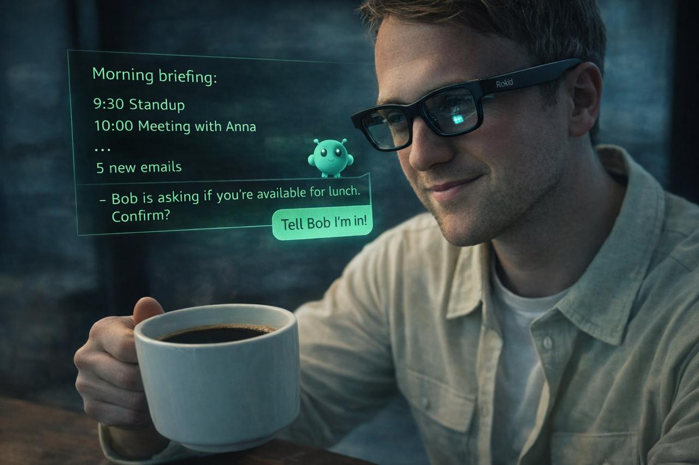

NOTE: Connecting to the gateway required disabling device security in the previous version (Feb 13). That is now fixed. Pull the latest version and retry if you had issues connecting to your gateway (and read the Connect section below on how to approve devices).

# Clawsses

Connect to your [OpenClaw](https://github.com/openclaw/openclaw) server 🦞 with your [Rokid Glasses](https://global.rokid.com/pages/rokid-glasses) 🕶️. Bring the power of OpenClaw with you anywhere you go. Give it voice command, send it photos of what you're looking at and see the answers stream in on the screens inside the glasses and hear your molty speak.

<p align="center">
  
</p>

<p align="center">
  
  
</p>

## What It Does

Clawsses connects your Rokid glasses to an OpenClaw Gateway, via your Android phone, giving you a wearable AI interface:

- **Voice-first interaction** - Long-press to speak, see the response appear in your HUD
- **Live streaming** - AI responses stream token-by-token onto the glasses display
- **Camera input** - Snap photos through the glasses camera and attach them to your message ("what am I looking at?")
- **Session management** - Switch between multiple OpenClaw sessions from the glasses
- **Text-to-speech** - Hear responses read aloud via ElevenLabs, controllable from the glasses
- **Wake-on-message** - Glasses display wakes automatically when new messages arrive
- **Slash commands** - Quick access to OpenClaw commands (`/model`, `/clear`, `/status`, etc.)

<p align="center">
  
  &nbsp;&nbsp;
  
  &nbsp;&nbsp;
  
</p>

## Architecture

The system is three components: a **phone app** that bridges everything, a **glasses app** that runs the HUD, and an **OpenClaw Gateway** that provides the AI backend.

```
OpenClaw Gateway ←─ WebSocket ──→ Phone App (Android) ←─ Bluetooth CXR ──→ Glasses App (Rokid)
      │                                │                                        │
  AI sessions                    Bridge + voice                          HUD + gestures
  Chat streaming                 TTS playback                           Camera capture
  Tool execution                 Wake management                        Session picker
```

### Modules

| Module | Description |
|--------|-------------|
| **phone-app/** | Android companion app. Connects to OpenClaw Gateway via WebSocket and to glasses via Rokid CXR-M SDK (Bluetooth). Handles voice recognition, TTS playback, wake signal coordination, and glasses APK sideloading. |
| **glasses-app/** | HUD app running on Rokid glasses. Renders chat UI with Jetpack Compose on the 480x640 monochrome green micro-LED display. Handles touchpad gestures and camera capture. |
| **shared/** | Protocol definitions (Gson-serialized data classes) used by both apps. |

## Setup

Intimadated by all the instructions below? Ask you OpenClaw to help to make things a lot easier.

### Prerequisites

- [Git](https://git-scm.com/download/)
- [Android Studio](https://developer.android.com/studio)
- Rokid Glasses (or emulator - see [Emulator Testing](#emulator-testing))
- A [Rokid developer account](https://developer.rokid.com/) for CXR SDK credentials (client secret + access key)
- A running [OpenClaw](https://github.com/openclaw/openclaw) Gateway

### 1. Enable USB Debugging on Your Phone

To install and debug the app on your Android phone:

1. Go to **Settings → About Phone** and tap **Build Number** 7 times to enable Developer Options
2. Go to **Settings → Developer Options** and enable **USB Debugging**
3. Connect your phone via USB cable
4. Accept the **"Allow USB Debugging?"** prompt on your phone

### 2. SDK Credentials

Create `local.properties` in the project root with your Rokid CXR SDK credentials:

```properties
rokid.clientSecret=your-client-secret
rokid.accessKey=your-access-key
```

You can create this file in Android Studio (right-click the project root → **New → File** → name it `local.properties`) or from the command line:

```bash
echo 'rokid.clientSecret=your-client-secret' > local.properties
echo 'rokid.accessKey=your-access-key' >> local.properties
```

These are injected as `BuildConfig` fields at compile time and are required for Bluetooth pairing with the glasses.

### 3. OpenClaw Gateway Setup

The phone app connects to your OpenClaw Gateway via WebSocket. A few things to configure:

**Set a gateway token** (used by the app to authenticate):
```bash
openclaw config set gateway.auth.token <your-token>
```

**Bind to your LAN interface.** By default, the gateway listens on loopback (`127.0.0.1`) only. To allow connections from your phone on the same network, change the bind address:
```bash
openclaw config set gateway.host 0.0.0.0
openclaw gateway restart
```

**For remote access** (outside your local WiFi), use [Tailscale](https://tailscale.com/) or another VPN rather than exposing the gateway to the public internet.

**Device approval:** The first connection from the app will fail — this is expected. OpenClaw requires you to approve new devices:

```bash
# After the first connection attempt, list pending devices
openclaw devices list

# Approve the device
openclaw devices approve <requestId>
```

After approval, the app will automatically reconnect.

### 4. Build & Install

Make sure to select the **`phone-app`** module (not `app`) in the run configuration dropdown at the top of Android Studio.

```bash
# Build both apps (glasses APK is bundled into phone app assets automatically)
./gradlew assembleDebug

# Install phone app via command line...
adb install phone-app/build/outputs/apk/debug/phone-app-debug.apk

# ...or just click the green ▶ Play button in Android Studio
```

The phone app bundles the glasses APK and can push it to the glasses over WiFi P2P - no developer cable needed.

### 5. Connect

<p align="center">
  
</p>

1. Open the phone app and configure your OpenClaw Gateway host, port, and token in Settings (I recommend using a VPN, like Tailscale and not connecting OpenClaw to the open Internet)
2. The first time you connect, the gateway will reject the connection because your device isn't paired yet. On the gateway, approve the pending device:
   ```bash
   # List pending pairing requests
   openclaw devices list

   # Approve the pending request (use the requestId from the gateway logs)
   openclaw devices approve <requestId>
   ```
   After approval, the app will automatically reconnect and receive a device token for future sessions.
3. Fold the right leg, and triple click the camera button to start pairing mode on the glasses.
4. Scan for and connect to your Rokid glasses via Bluetooth
5. Use the Install to glasses button in the settings screen to load the app onto the glasses via Wifi
6. Put on the glasses and find the app in the last position of your apps screen
7. The glasses HUD will show the connection status and your current session

> **Note:** The app uses Ed25519 device identity for authentication. On first launch, it generates a keypair that uniquely identifies your device. The gateway must approve this device before allowing connections. This is the same security model used by the OpenClaw CLI and Control UI.

## Usage

### Voice Input

Long-press on the glasses temple to start voice recognition.

Two speech recognition backends are supported:
- **OpenAI Realtime API** (primary) - streaming transcription via Whisper with server-side VAD, multi-segment speech support, and audio pre-buffering for zero-latency start. Note: only shows the recognized speech once you stop speaking.
- **Android SpeechRecognizer** (fallback) - used automatically when no OpenAI API key is configured; shows speech while you talk, but recognition isn't as great.

Configure your OpenAI API key in Settings > Voice to enable the primary backend.

### Temple Touchpad Gestures

The glasses touchpad has two focus areas that change what gestures do:

| Gesture | Message History | Menu Bar |
|---------|-------------|----------|
| **Swipe forward** (→ eyes) | Scroll down | Previous menu item |
| **Swipe backward** (→ ear) | Scroll up | Next menu item |
| **Tap** | Scroll to bottom | Execute menu action |
| **Double-tap** | Jump to menu  | Exit app |
| **Long-press** | Voice input | Voice input |

### Menu Bar

| Item | Action |
|------|--------|
| 📷 Photo | Capture a photo to attach to your next message (up to 4) |
| ◎ Session | Open session picker - browse, switch, or create sessions |
| █ Size | Cycle HUD position: Full → Bottom Half → Top Half |
| … More | Font size, slash commands, toggle voice responses |

<p align="center">
  
  &nbsp;&nbsp;
  
  &nbsp;&nbsp;
  
</p>

### Camera

Tap the Photo menu item to capture an image through the glasses camera. Photos are attached to your next voice message as base64-encoded images, enabling multimodal AI interactions ("what does this error message say?", "describe what I'm looking at"). You can attach up to 4 photos.

### Text-to-Speech

Toggle voice responses from the More menu on the glasses. When enabled, AI responses are spoken aloud via ElevenLabs TTS. Configure your ElevenLabs API key and preferred voice in the phone app Settings.

### Wake-on-Message

When new content arrives (streaming responses, proactive messages, cron notifications), the phone automatically wakes the glasses display via the CXR SDK and delivers buffered messages once the glasses acknowledge readiness. A keep-alive mechanism prevents the display from sleeping during long streaming responses.

## Display

The Rokid AR Lite uses JBD 0.13" micro-LED displays:
- **Resolution:** 480x640 (portrait)
- **Color:** Monochrome green on transparent AR waveguide
- **Brightness:** 1500 nits
- **Font:** JetBrains Mono
- **Font sizes:** Compact / Normal / Comfortable / Large (configurable from glasses)

## Emulator Testing

You can develop without physical glasses by using the built-in debug mode. In debug builds, Bluetooth is replaced with a local WebSocket connection:

1. Create a glasses AVD: **480x640**, 5" screen
2. Run the phone emulator - it starts a WebSocket server on port 8081
3. Run the adb command as specified in the settings screen
4. Run the glasses emulator - it auto-connects to `10.0.2.2:8081`
   
```bash
# Phone app (includes glasses APK in assets)
./gradlew :phone-app:installDebug

# Glasses app
./gradlew :glasses-app:installDebug
```

## OpenClaw Protocol

The phone app implements the [OpenClaw Gateway protocol](https://docs.openclaw.ai):

- **Authentication:** Token auth + Ed25519 device identity (keypair stored in Android Keystore)
- **Chat:** Sends `chat.send`, receives streaming `chat` events with accumulated text (client diffs to extract new content)
- **Sessions:** Full session management - list, switch, create, reset
- **Auto-reconnect:** 3-second backoff on disconnect

## Phone-Glasses Protocol

Communication between phone and glasses uses JSON messages over the CXR SDK bridge (or WebSocket in debug mode):

**Phone → Glasses:** `chat_message`, `agent_thinking`, `chat_stream`, `chat_stream_end`, `connection_update`, `session_list`, `voice_state`, `voice_result`, `wake_signal`, `tts_state`

**Glasses → Phone:** `user_input` (text + optional photo), `list_sessions`, `switch_session`, `slash_command`, `start_voice`, `cancel_voice`, `request_more_history`, `wake_ack`, `tts_toggle`

## Screenshots

See the full [screenshot gallery](docs/SCREENSHOTS.md) for more images of the glasses HUD and phone app.

## Troubleshooting

### "Connection refused" / app won't connect

- Verify the OpenClaw Gateway is running and the correct IP, port, and token are entered in the app's Settings
- Make sure the gateway is bound to your LAN interface (`0.0.0.0`), not loopback (`127.0.0.1`) — see [Gateway Setup](#3-openclaw-gateway-setup)
- Check that your phone is on the same WiFi network as the machine running the gateway
- For remote access (outside your LAN), you need [Tailscale](https://tailscale.com/) or a VPN

### "Pairing required" / first connection fails

This is normal! OpenClaw requires device approval before allowing connections:

1. The first connection attempt will be rejected
2. Run `openclaw devices list` to see the pending device
3. Run `openclaw devices approve <requestId>` to approve it
4. The app will automatically reconnect

### App crashes on startup

- Ensure `local.properties` exists in the project root with valid Rokid CXR SDK credentials
- Try a clean build: **Build → Clean Project**, then **Build → Rebuild Project**

### Glasses app installation fails

- Retry the installation from the phone app settings
- If it keeps failing, unpair and re-pair the Bluetooth connection with the glasses, then try again

### Voice recognition not working

- Without an OpenAI API key, the app falls back to Android's built-in speech recognition
- For better results, add your OpenAI API key in **Settings → Voice**

### No audio / TTS not working

- Configure your ElevenLabs API key in the phone app **Settings**
- On the glasses, make sure TTS is enabled via the **More** menu (… → toggle voice responses)

## License

Copyright (C) 2026 Pohlster BV

This project is licensed under the [GNU Affero General Public License v3.0](LICENSE) (AGPL-3.0).

You are free to use, modify, and distribute this software under the terms of the AGPL-3.0. Any modified versions must also be made available under the same license.

**Commercial licensing:** If you want to use Clawsses in a commercial / closed-source product, a commercial license is available. Contact Daan Weddepohl on Linkedin.

**Third-party components:** This project uses the Rokid CXR SDK, which is proprietary and licensed separately by Rokid Corporation. It is not redistributed as part of this source code.
