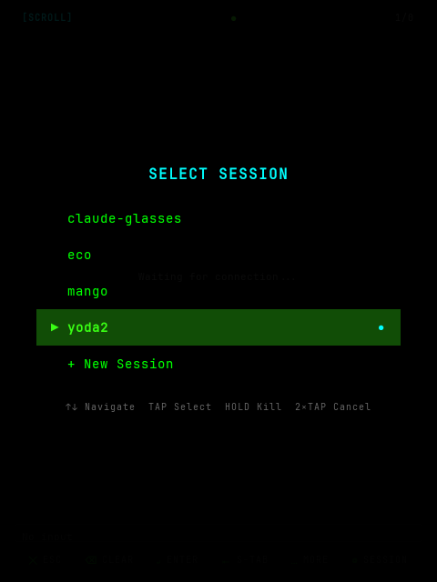
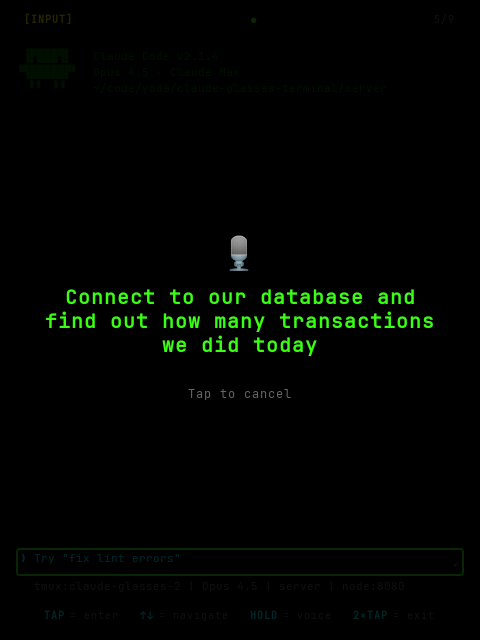
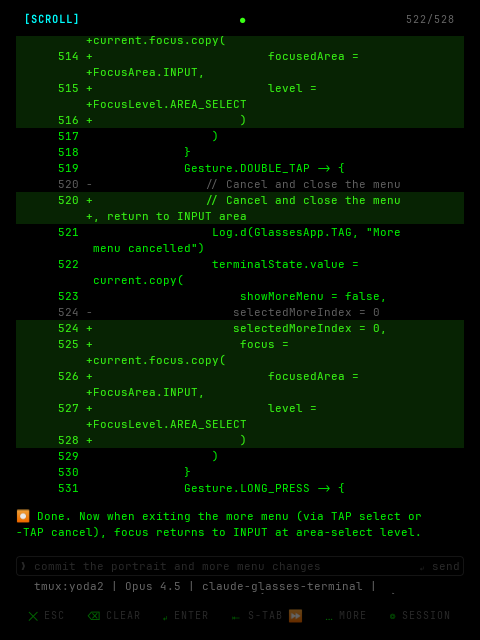

# Claude Glasses Terminal

A wearable terminal interface for [Claude Code](https://docs.anthropic.com/en/docs/claude-code) on [Rokid AR Lite](https://www.rokid.com/en/product/ar-lite/) glasses. View and interact with Claude Code through AR glasses using voice commands and touchpad gestures.

## See Claude Code While You Work

Imagine reviewing code changes while standing at a whiteboard, or dictating a database query while your hands are busy. Claude Glasses puts a terminal in your field of view, controlled entirely by voice and gestures.

### Manage Multiple Sessions

<p align="center">
  
</p>

Switch between different Claude Code sessions on the fly. Each project gets its own persistent tmux session — navigate between them with swipes, select with a tap.

### Voice-First Input

<p align="center">
  
</p>

Long-press the glasses side button and speak naturally. Voice recognition uses the glasses' 4-mic array via Bluetooth SCO, and works even when the phone screen is off (via foreground service).

### Review Code Hands-Free

<p align="center">
  
</p>

Scroll through diffs, read Claude's explanations, and navigate the terminal — all with simple gestures on the temple touchpad. The monochrome green display blends into your environment while keeping the code visible.

### Bootstrapped

This project was built using itself. Claude Glasses was used to build Claude Glasses.

## Architecture

```
┌─────────────────────────────────────────────────────────┐
│                   REMOTE SERVER                         │
│  ┌─────────────────────────────────────────────────┐    │
│  │           server/ (Node.js)                     │    │
│  │  • Runs Claude Code in tmux session             │    │
│  │  • WebSocket endpoint for phone connection      │    │
│  │  • Delta terminal updates (only changed lines)  │    │
│  │  • Multi-session management                     │    │
│  └─────────────────────────────────────────────────┘    │
└──────────────────────────┬──────────────────────────────┘
                           │ WebSocket
┌──────────────────────────▼──────────────────────────────┐
│                      PHONE                              │
│  ┌─────────────────────────────────────────────────┐    │
│  │           phone-app/ (Android)                  │    │
│  │  • CXR-M SDK for glasses communication         │    │
│  │  • WebSocket client to server                   │    │
│  │  • Voice recognition via glasses mic array      │    │
│  │  • Foreground service for background operation  │    │
│  │  • Bridges server ↔ glasses                     │    │
│  └─────────────────────────────────────────────────┘    │
└──────────────────────────┬──────────────────────────────┘
                           │ BLE (CXR protocol)
┌──────────────────────────▼──────────────────────────────┐
│                     GLASSES                             │
│  ┌─────────────────────────────────────────────────┐    │
│  │           glasses-app/ (Android)                │    │
│  │  • CXR-S SDK for phone communication           │    │
│  │  • HUD display (monochrome green, 480×640)      │    │
│  │  • Touchpad gesture input (3 modes)             │    │
│  │  • AI scene button triggers voice input         │    │
│  └─────────────────────────────────────────────────┘    │
└─────────────────────────────────────────────────────────┘
```

## Project Structure

```
claude-glasses-terminal/
├── phone-app/              # Android app for phone (CXR-M SDK)
│   └── src/main/java/com/claudeglasses/phone/
│       ├── glasses/        # Glasses connection management
│       ├── terminal/       # WebSocket terminal client
│       ├── voice/          # Voice command handling
│       ├── service/        # Foreground service
│       └── ui/             # Jetpack Compose UI
│
├── glasses-app/            # Android app for glasses (CXR-S SDK)
│   └── src/main/java/com/claudeglasses/glasses/
│       ├── ui/             # HUD display components
│       ├── input/          # Gesture handling
│       ├── service/        # Phone connection service
│       └── debug/          # Emulator WebSocket client
│
├── shared/                 # Shared protocol definitions
│
└── server/                 # Node.js WebSocket server
    └── src/
        └── index.js        # Claude Code tmux wrapper
```

## Setup

### Prerequisites

- Android Studio (latest)
- Node.js 18+
- tmux (`brew install tmux` on macOS)
- Claude Code CLI installed and configured
- Rokid AR Lite glasses (RV101, YodaOS-Sprite)
- Rokid developer account (for CXR SDK credentials)

### 1. Server Setup

```bash
cd server
npm install
npm start
```

The server starts on port 8080 with a 64-column terminal optimized for the glasses HUD. Use Tailscale or another VPN to expose it to your phone on the go.

### 2. SDK Credentials

Add your Rokid CXR-M SDK credentials to `local.properties`:

```properties
rokid.clientId=xxx
rokid.clientSecret=xxx
rokid.accessKey=xxx
```

### 3. Phone App

1. Open the project in Android Studio
2. Build and install `phone-app` on your Android phone
3. Configure the server URL in the app

### 4. Glasses App

Using CXR-M SDK from your phone app:
1. Build the `glasses-app` APK
2. Use the phone app to push the APK to your glasses over WiFi

Or via ADB (requires Rokid developer cable):
```bash
adb install glasses-app/build/outputs/apk/debug/glasses-app-debug.apk
```

## Usage

### Gesture Controls

The temple touchpad supports three modes, cycled via double-tap:

| Mode | Forward/Backward Swipe | Tap | Double-Tap | Long Press |
|------|------------------------|-----|------------|------------|
| **SCROLL** | Scroll up/down | Jump to end | Switch mode | Voice input |
| **NAVIGATE** | Arrow up/down | Enter | Switch mode | Voice input |
| **COMMAND** | Tab / Escape | Shift-Tab | Switch mode | Voice input |

**Swipe directions:**
- Forward (towards eyes) = scroll up / arrow up / tab
- Backward (towards ear) = scroll down / arrow down / escape

### Voice Input

Long-press the glasses side button to activate voice recognition. Speak naturally — your speech is sent as a prompt to Claude Code. Special commands:

| Say | Action |
|-----|--------|
| "slash help" | Types `/help` |
| "slash compact" | Types `/compact` |
| "escape" | Sends ESC key |
| "scroll up/down" | Scrolls terminal |
| "take screenshot" | Captures and sends glasses camera image |
| *(anything else)* | Sent as text input to Claude Code |

### Hardware Buttons

- Volume Up/Down: Scroll up/down
- Back: ESC

## Display

The glasses use JBD 0.13" micro LED displays (per eye):
- Resolution: **480×640** (portrait mode)
- Pixel density: ~6,150 DPI
- Monochrome green, 1500 nits
- Terminal: **64 columns × 31 rows**
- Pure black background (transparent on AR waveguide)
- JetBrains Mono font for box-drawing characters

## Emulator Testing

For development without physical glasses, debug builds use WebSocket instead of Bluetooth:

1. **Create a glasses emulator**: 480×640, 5.0" screen
2. **Phone emulator** starts a WebSocket server on port 8081
3. **Glasses emulator** connects to `10.0.2.2:8081`

```bash
# Terminal 1: Start the server
cd server && npm start

# Terminal 2: Run phone app
./gradlew :phone-app:installDebug

# Terminal 3: Run glasses app
./gradlew :glasses-app:installDebug
```

## Documentation

- [CLAUDE.md](CLAUDE.md) - Development context and guidelines
- [docs/ROKID.md](docs/ROKID.md) - Rokid hardware specs and SDK reference

## License

MIT
