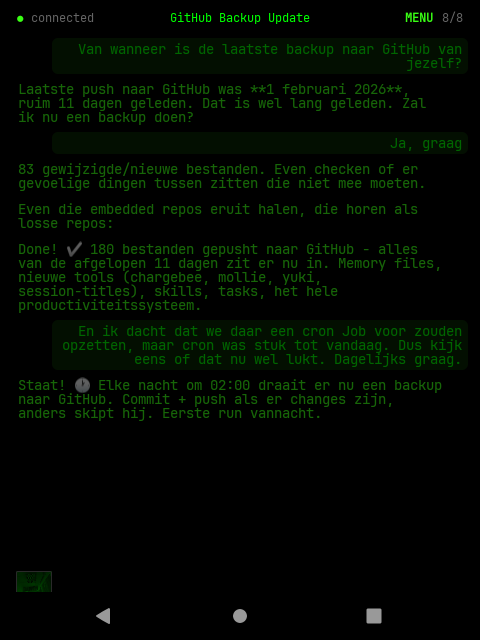
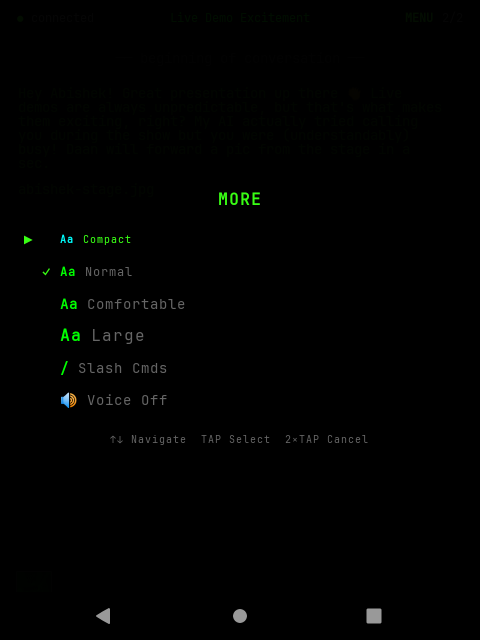
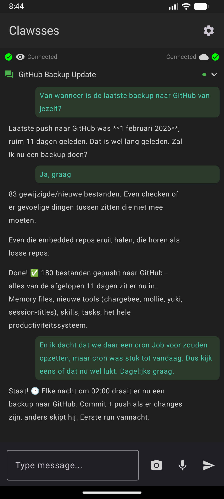
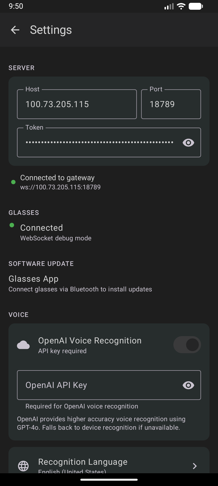
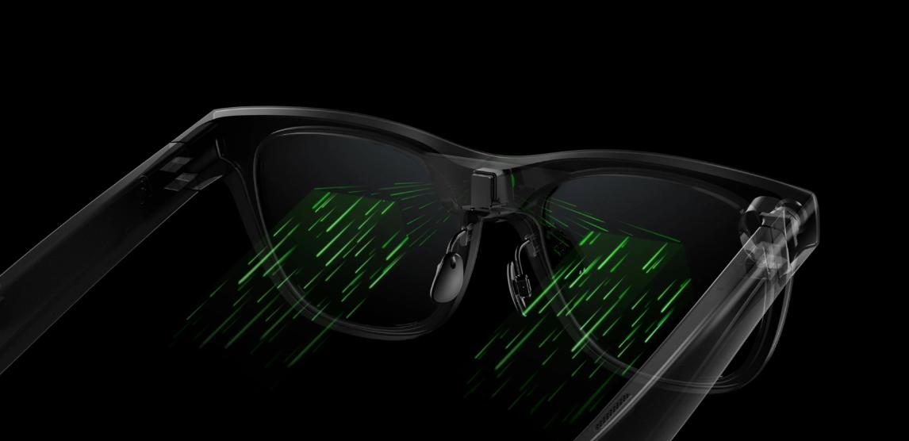
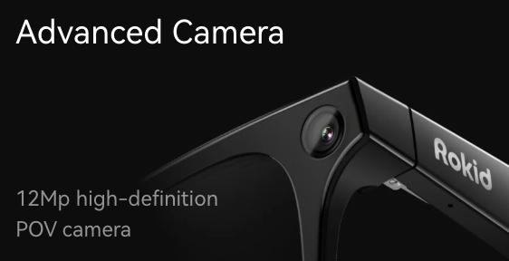

# Screenshots

## Glasses HUD

### Chat View

The monochrome green micro-LED display shows streaming AI responses with user messages highlighted. The menu bar at the bottom provides quick access to camera, session picker, display size, and more.

  

  

### Session Picker

Browse and switch between OpenClaw sessions. Each session shows its name and how recently it was active.

  

### Slash Commands

Quick access to OpenClaw commands like `/model`, `/status`, `/compact`, and more - all navigable with touchpad gestures.

  

### More Menu

Configure font size (Compact / Normal / Comfortable / Large), access slash commands, and toggle voice responses.

  

## Phone App

### Chat View

The companion app mirrors the glasses conversation, with a text input field, camera button for photo capture, and voice input button.

  

### Settings

Configure your OpenClaw Gateway connection, glasses pairing, OpenAI voice recognition, ElevenLabs TTS, and developer options.

  
  &nbsp;&nbsp;&nbsp;&nbsp;
  

## Hardware

### Rokid Glasses

  

  
  &nbsp;&nbsp;
  

